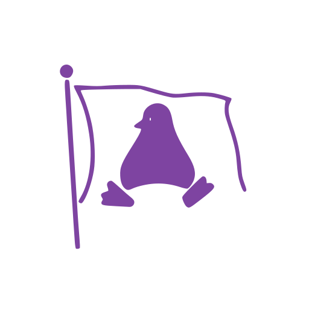

# Linux-CTF-ARQPYB: BETA Aberta Build 

> Por favor ler atentamente ate o final :)

---
## Resumo

Nesta BETA aberta búscase coñecer a opinión que tén o público obxectivo do proxecto acerca do software desenvolvido ao longo dos últimos 5 meses.
Agradeceríase coñecer o voso feedback a través do [formulario](https://forms.office.com/Pages/ResponsePage.aspx?id=PuqhzrJgdU-mwqYCLo-WG24jIPE1fOVLrA-D0deCrrhUMzJHRE5ZSFo3RzFXMkdLSjlOTkM4NzBBVC4u) unha vez rematedes de probar o proxecto, así como dos erros que poidades atopar ao fedellar.

---
## Indicacións

> [!WARNING]
> Leer con detemento, esta versión está en desenvolvemento polo que pode conter bugs

### Instalación

Este proxecto a día de hoxe conta cunha compatibilidade con sistemas linux (Ubuntu / debian) [ o resto non se garante o seu funcionamento xa que non se probaron]  e con sistemas Windows.

#### Linux

Preme aqui para instalar:

E descarga o arquivo **linux_install.zip**

> [!NOTE]
> Para poder executar o proxecto é necesario ter instalado [Docker](https://docs.docker.com/engine/install/) e configurar o usuario co que se vai traballar como [usuario Docker](https://docs.docker.com/engine/install/linux-postinstall/).
> Tamén é recomendable ter instalado o unzip (`sudo apt install unzip`)

1. Para instalar é preciso descargar a carpeta co contido e poñela alí onde ti consideres, debería conter os seguintes arquivos:
~~~
.
├── install.sh
├── Linux_CTF_ARQPYB.desktop
├── Linux_CTF_ARQPYB.zip
└── uninstall.sh

1 directory, 4 files
~~~
2. Abre un terminal no directorio (click esquerdo > abrir terminal) e introduce os seguintes comandos:
~~~
chmod +x install.sh
chmod +x uninstall.sh
~~~
Estes comandos darán permisos de execución, necesarios para poder instalar os arquivos. A continuación para instalar insire
~~~
sudo ./install.sh
~~~
Unha vez remate, deberías ter un aplicativo no menú chamado Linux_CTF_ARQPYB, disfruta da experiencia

> En caso de fallar o icono, podes abrir o docker dende unha consola co comando `xhost +local: && docker start arqpyb_run`

3. Para desinstalar simplemente executa.
~~~
sudo ./uninstall.sh
~~~

#### Windows

Preme aqui para instalar:

E descarga o arquivo **windows_install.zip**

> [!NOTE]
> Para poder executar o proxecto é necesario ter instalado [Docker](https://docs.docker.com/desktop/setup/install/windows-install/) e un intérprete de X11, recoméndase encarecidamente o uso de [**Xming**](https://sourceforge.net/projects/xming/)

1. Para instalar é preciso descargar a carpeta co contido e poñela alí onde ti consideres, debería conter os seguintes arquivos:
~~~
.
├── install.bat
├── Linux_CTF_ARQPYB.lnk
├── Linux_CTF_ARQPYB.zip
└── uninstall.bat

1 directory, 4 files
~~~
2. Fai doble clic para executar o `install.bat`, é preciso darlle permisos para que poida instalar satisfactoriamente, unha vez instalado crearase un icono no escritorio co Linux_CTF_ARQPYB
3. Para executar a contorna recoméndase ter correndo en segundo plano o Docker e o _
> En caso de fallar o icono, podes abrir o docker dende unha consola co comando `docker start arqpyb_run`
4. Para desinstalar fai doble clic para executar o `uninstall.bat`

### Funcionamento

#### Interface

A interface é sinxela, conta cun menú para cambiar o idioma da contorna e un botón para facilitar a revisión de retos ou acceso dos mesmos, ademáis conta cun terminal para levar a cabo os retos.

#### Linux-CTF-ARQPYB

Ao iniciar a interface mostrase toda a información relevante, pero por se a caso repítese aqui

As normas son moi sinxelas: iranse xerando retos cunha dificultade acorde co teu nivel de habilidade e terás que atopar en cada reto as bandeiras. Todas as bandeiras seguen a mesma estrutura: `ARQPYB-XxXxXxXxX`.
- Para ler o reto, pon o comando `reto`.
- Para validar unha bandeira, pon o comando `flag`.
- Para reiniciar os niveis, pon o comando `restart`.
Ao finalizar todos os retos imprimiránse por pantalla cos resultados dos exercicios. 

## Licencia
Este proxecto está licenciado baixo a [Licencia Creative Commons BY-NC](./LICENSE). Podes usar, modificar e distribuir o software segundo as condicións descritas no arquivo de licencia.