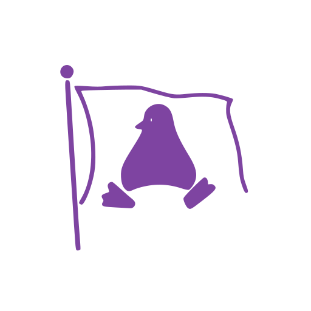

# Linux-CTF-ARQPYB: v.1.0

> Por favor ler atentamente ate o final :)

## Resumo

Benvide a Linux-CTF-ARQPYB v.1.0, unha contorna adaptable e doada deseñada para aprender ou mellorar o teu control nos comandos Linux.

---
## Indicacións

> [!WARNING]
> Ler con detemento

### Instalación

> Actualmente, este proxecto é compatible con sistemas Linux (Ubuntu/Debian) [no resto de sistemas non se garante o seu funcionamento, xa que non foron probados] e con sistemas Windows.

#### Linux

Preme aqui para instalar:

E descarga o arquivo **linux_install.zip**

> [!NOTE]
> Para poder executar o proxecto é necesario ter instalado [Docker](https://docs.docker.com/engine/install/) e configurar o usuario co que se vai traballar como [usuario Docker](https://docs.docker.com/engine/install/linux-postinstall/).
> Tamén é recomendable ter instalado **unzip** (`sudo apt install unzip`)

1. Descarga o contido e descomprime a carpeta no lugar que consideres. Debería conter os seguintes arquivos:
~~~
.
├── install.sh
├── Linux_CTF_ARQPYB.desktop
├── Linux_CTF_ARQPYB.zip
└── uninstall.sh
~~~
2. Abre un terminal no directorio (clic dereito > abrir terminal) e introduce os seguintes comandos:
~~~
chmod +x install.sh
chmod +x uninstall.sh
~~~
Estes comandos outorgan permisos de execución necesarios para instalar os arquivos. A continuación, introduce:
~~~
sudo ./install.sh
~~~
Unha vez rematada a instalación, deberías ter un aplicativo no menú chamado Linux_CTF_ARQPYB. Disfruta da experiencia! 😊

> En caso de que a icona non funcione, podes abrir Docker dende unha terminal co comando: `xhost +local: && docker start arqpyb_run`

3. Para desinstalar simplemente executa.
~~~
sudo ./uninstall.sh
~~~

#### Windows

Preme aqui para instalar:

E descarga o arquivo **windows_install.zip**

> [!NOTE]
> Para poder executar o proxecto é necesario ter instalado [Docker](https://docs.docker.com/desktop/setup/install/windows-install/) e un intérprete de X11, recoméndase encarecidamente o uso de [**Xming**](https://sourceforge.net/projects/xming/)

1. Descarga o contido e descomprime a carpeta no lugar que consideres. Debería conter os seguintes arquivos:
~~~
.
├── install.bat
├── Linux_CTF_ARQPYB.lnk
├── Linux_CTF_ARQPYB.zip
└── uninstall.bat
~~~
2. Fai dobre clic en `install.bat`. É necesario outorgar permisos para que poida instalarse correctamente. Unha vez instalado, crearase unha icona no escritorio chamado **Linux_CTF_ARQPYB**
> Seguramente salte un aviso de que o script ven dun **editor descoñecido**, simplemente tes que clicar en **máis información > Executar de todas formas**
3. Para executar a contorna **recoméndase ter correndo en segundo plano o Docker e o Xming**
> En caso de que a icona non funcione, podes abrir Docker dende unha consola co comando: `docker start arqpyb_run`
4. Para desinstalar, fai dobre clic en `uninstall.bat`

### Funcionamento

#### Interface

A interface é sinxela. Inclúe:
- Un menú para cambiar o idioma da contorna.
- Un botón que facilita acceso aos retos.
- Un terminal para resolver os retos.
- Un botón para imprimir o enunciado do reto polo terminal.
- Un botón para reiniciar os retos.

#### Linux-CTF-ARQPYB

Ao iniciar a interface móstrase toda a información relevante, pero aquí a repetimos por se fose necesario.

As normas son moi sinxelas:

- Xeraranse retos cunha dificultade acorde co teu nivel de habilidade.
- En cada reto deberás atopar a bandeira, que seguen a estrutura: `ARQPYB-XxXxXxXxX.`

Comandos dispoñibles:

- `reto` para ler o reto.
- `flag` para validar unha bandeira. (`flag ARQPYB-XxXxXxXxX`)
- `restart` para reiniciar os niveis.

Ao rematar todos os retos, imprimirase un resumo cos resultados.

## Licencia
Este proxecto está licenciado baixo a [Licencia Creative Commons BY-NC](./LICENSE). Podes usar, modificar e distribuir o software segundo as condicións descritas no arquivo de licencia.